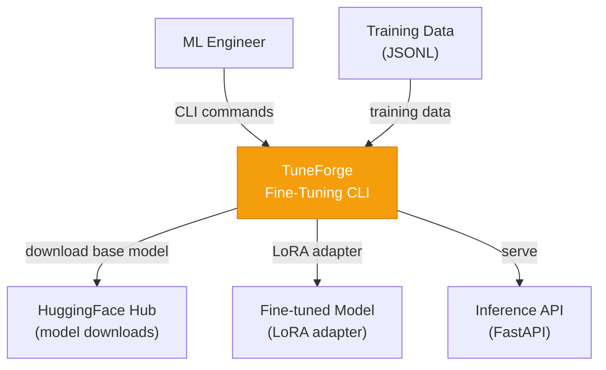
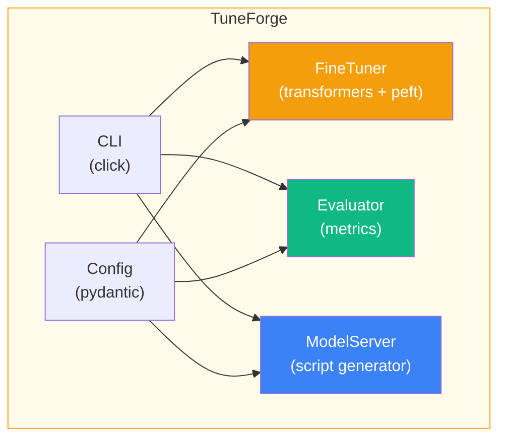
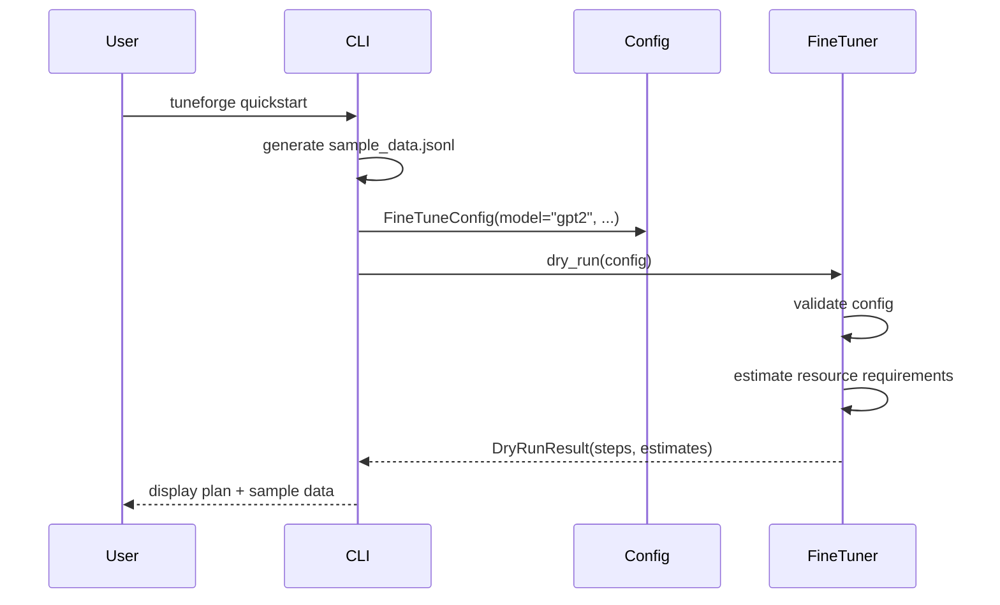

# TuneForge Architecture

## Overview

TuneForge is a CLI that simplifies the fine-tune → evaluate → serve workflow for open-source LLMs. It provides graceful degradation: full functionality with GPU packages, dry-run/planning mode without them.

## C4 Diagrams

### Level 1: System Context

### Level 2: Container Diagram

### Sequence Diagram: Quickstart Flow

## Design Decisions

### Graceful Degradation Without GPU Packages

**Chose:** Core CLI works without `transformers`/`peft`/`torch`. These are optional extras (`pip install tuneforge[gpu]`).

**Why:** Many users want to explore the workflow, plan fine-tuning, or generate scripts without a GPU machine. The `--dry-run` flag and `quickstart` command work on any machine.

### Script Generation vs. Direct Serving

**Chose:** Generate standalone serve scripts rather than embedding a full inference server.

**Why:** Inference servers (vLLM, TGI) have complex dependencies. Generating a script lets users customize and run it in their own environment.

## Extension Points

1. Additional model families (Llama, Phi, Gemma)
2. Custom evaluation metrics
3. Integration with eval frameworks (DeepEval, Promptfoo)
4. Direct vLLM/TGI serve mode
